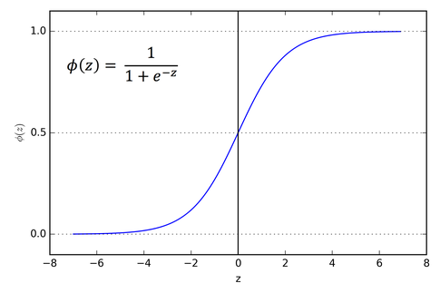

<h1 align=center>Models from Scratch</h1>

### Author: [Manthan](https://github.com/cryptic-mortal)  
### Language: Python 
## Table of Contents
- [Overview](#overview)
- [Linear Regression](#linear-regression)
  - [Class Structure](#class-structure)
  - [Example Usage](#example-usage)
- [Lasso Regression](#lasso-regression)
  - [Class Structure](#class-structure-1)
  - [Example Usage](#example-usage-1)
- [Ridge Regression](#ridge-regression)
  - [Class Structure](#class-structure-2)
  - [Example Usage](#example-usage-2)
- [Logistic Regression](#logistic-regression)
  - [Class Structure](#class-structure-3)
  - [Example Usage](#example-usage-3)
- [Installation](#installation)
- [To Do](#to-do)
- [Credits](#credits)
## Overview
This project is a from-scratch implementation of Machine Learning and Deep Learning models. The goal is to create models from scratch to gain a clear understanding of how these models work under the hood, without relying on high-level libraries like Sklearn, TensorFlow or PyTorch.
## Models
### Linear Regression
This implementation of [Linear Regression](models.py) supports:
- Multi-Target regression (`Y.shape = (n, k)`)
- Mean Squared Error (MSE) loss
- Batch Gradient Descent
- Tracks:
  - `loss_history`
  - `W_history` (weights over time)
  - `b_history` (biases over time)
- Optional logging (`verbose=True`)

#### Class Structure:

```python
class LinearRegression():
    def __init__(self, learning_rate=0.1, iterations=100, verbose=True)
    def fit(self, X, Y)
    def predict(self, X)
    def compute_loss(self, Y_pred, Y)
    def compute_grad(self, X, Y_pred, Y)
```

#### Example usage:

```python
from models import LinearRegression
import numpy as np 

my_model = LinearRegression(learning_rate = 0.03, iterations = 1000)
my_model.fit(X_train,y_train)
y_pred = my_model.predict(X_test)
print(f"Loss : {my_model.compute_loss(y_pred,y_test)}")
```
For more details, refer to the [Linear Regression Implementation](LR.ipynb).

### Lasso Regression
Lasso Regression is a regularized version of Linear Regression that adds an L1 penalty to the loss function, which can help in feature selection by driving some weights to zero.

This implementation of [Lasso Regression](models.py) supports:
- Multi-Target regression (`Y.shape = (n, k)`)
- L1 regularization
- Batch Gradient Descent
- Tracks:
  - `loss_history`
  - `W_history` (weights over time)
  - `b_history` (biases over time)
- Optional logging (`verbose=True`)

#### Class Structure:

```python
class LassoRegression(LinearRegression):
    def __init__(self, learning_rate=0.1, iterations=100, verbose=True, lambda_=0.1)
    def compute_loss(self, Y_pred, Y)
    def compute_grad(self, X, Y_pred, Y)
```
#### Example usage:

```python
from models import LassoRegression
import numpy as np

my_model = LassoRegression(learning_rate = 0.03, iterations = 1000, lambda_=0.1)
my_model.fit(X_train, y_train)
y_pred = my_model.predict(X_test)
print(f"Loss : {my_model.compute_loss(y_pred, y_test)}")
```
For more details, refer to the [Lasso Regression Implementation](Lasso.ipynb).
### Ridge Regression
Ridge Regression is another regularized version of Linear Regression that adds an L2 penalty to the loss function, which helps in reducing overfitting by penalizing large weights. It does not perform feature selection like Lasso but is useful when you want to keep all features while controlling their impact.

This implementation of [Ridge Regression](models.py) supports:
- Multi-Target regression (`Y.shape = (n, k)`)
- L2 regularization
- Batch Gradient Descent
- Tracks:
  - `loss_history`
  - `W_history` (weights over time)
  - `b_history` (biases over time)
- Optional logging (`verbose=True`)

#### Class Structure:

```python
class RidgeRegression(LinearRegression):
    def __init__(self, learning_rate=0.1, iterations=1000, verbose=True, lambda_=0.1)
    def compute_loss(self, Y_pred, Y)
    def compute_grad(self, X, Y_pred, Y)
```
#### Example usage:
```python
from models import RidgeRegression
import numpy as np

my_model = RidgeRegression(learning_rate=0.01, iterations=1000, lambda_=0.1)
my_model.fit(X_train, y_train)
y_pred = my_model.predict(X_test)
print(f"Loss : {my_model.compute_loss(y_pred, y_test)}")
```
For more details, refer to the [Ridge Regression Implementation](RR.ipynb).

### Logistic Regression
Logistic Regression is a classification algorithm that uses the logistic function(sigmoid function) to model the probability of a binary outcome. It is widely used for binary classification tasks.

<figure style="text-align: center;">
  
  <figcaption>
    <span class="caption">Logistic Function</span>
    <br>
    <i class="photo-credit">Understanding the Sigmoid Function in Logistic Regression: Mapping Inputs to Probabilities by Swaroop Piduguralla</i>
  </figcaption>
</figure>

This implementation of [Logistic Regression](models.py) supports:
- Binary classification
- Sigmoid activation function
- Cross-Entropy loss
- Batch Gradient Descent
- Accuracy metric
- Tracks:
  - `loss_history`
  - `W_history` (weights over time)
  - `b_history` (biases over time)
- Optional logging (`verbose=True`)

#### Class Structure:

```python
class LogisticRegression():
    def __init__(self, learning_rate=0.1, iterations=1000, verbose=True)
    @staticmethod
    def sigmoid(z)
    def fit(self, X, Y)
    def predict_raw(self, X)
    def predict(self, X)
    def compute_loss(self, Y_pred, Y)
    def compute_grad(self, X, Y_pred, Y)
    def accuracy(self, Y_pred, Y)
```
#### Example usage:

```python
from models import LogisticRegression
import numpy as np

my_model = LogisticRegression(learning_rate=0.01, iterations=1000)
my_model.fit(X_train, y_train)
y_pred = my_model.predict(X_test)
print(f"Loss : {my_model.compute_loss(y_pred, y_test)}")
print(f"Accuracy : {my_model.accuracy(y_pred, y_test)}")
```

For more details, refer to the [Logistic Regression Implementation](BLR.ipynb).
## Installation
To use this project, clone the repository:
```bash
git clone https://github.com/cryptic-mortal/Models-from-Scratch.git
```
Then, you can use the models by importing them into your Python scripts or Jupyter notebooks.

## To Do
- Implement more models such as:
  - Support Vector Machines (SVM)
  - Decision Trees

## Credits
- [Machine Learning Course](https://www.youtube.com/playlist?list=PLfFghEzKVmjsNtIRwErklMAN8nJmebB0I) by Siddhardhan
- [Lasso Regression](https://www.geeksforgeeks.org/machine-learning/what-is-lasso-regression/) by GeeksforGeeks